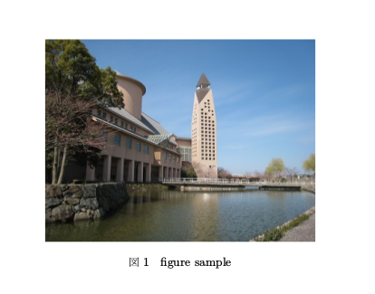

# latex ゼミ 2


---

## 本日のスライド

HTML 形式(https://github.com/tono-chan/tex_slide/blob/master/draft.md)

{width=5cm}

SLIDE 形式(https://tono-chan.github.io/tex_slide/)

{width=5cm}

---

## 目次

* [latex ゼミ 2](#latex-ゼミ-2)
* [LaTeX の書き方](#latex-の書き方)
* [latex のエラー修正](#latex-のエラー修正)
* [課題](#課題)
* [参考元](#参考元)


---

## LaTeX って何？
TeX とは理系でよく使われる組版言語です．

LaTeX はTeXに対して機能拡張をして使いやすくしたものです．

LaTeX を利用することで整った体裁の文書を作成できます．

---

## 組版って？

組版・・・・印刷を作るときに、どんなサイズの紙に、紙のどのあたりに、どんな文字で、どんな並べ方で、

文字や図版をレイアウトするかといったレイアウト作業

---

## TeX ができた由来
ドナルド・クヌース(Donald Ervin Knuth) って人が自分の本を出版するときに、業者に依頼した組版の出来に不満。

あまりの汚さにブチ切れたクヌース先生が自前で組版するために作ったソフト。

なければ自分で作るってところがプログラマー気質ですよね。

---

## LATEXのコンパイルの仕方
GUIの操作は使用するソフトによって異なるので省略。

コマンドライン操作のみで説明します。

tex ファイルから pdfファイル作成までを記述

---

### platex

使用している文字コードがshift_jisの場合(使用ソフトがL'ecrivain)

```bash
$ platex sample.tex     #dviファイルを作成
$ dvipdfmx sample.dvi   #pdfファイルを作成
```

---

### uplatex
使用している文字コードがutf8の場合(使用ソフトがTexWorks)

```bash
$ uplatex sample.tex     #dviファイルを作成
$ dvipdfmx sample.dvi    #pdfファイルを作成
```

---

### 2回もコンパイルがめんどくさい人向け

shift_jis の場合
```bash
$ ptex2pdf -l sample.tex
```

utf8の場合
```
$ ptex2pdf -u -l sample.tex
```

---

### いちいちコンパイルコマンドを打つのが面倒くさい人向け：下準備
下準備

以下のファイルをユーザーフォルダ直下(compフォルダ)に [.latexmkrc](/distribute/.latexmkrc) という名前で保存

```perl
#!/usr/bin/env perl
$latex            = 'platex -synctex=1 -halt-on-error';
$latex_silent     = 'platex -synctex=1 -halt-on-error -interaction=batchmode';
$bibtex           = 'pbibtex';
$dvipdf           = 'dvipdfmx %O -o %D %S';
$makeindex        = 'mendex %O -o %D %S';
$max_repeat       = 5;
$pdf_mode	  = 3; # generates pdf via dvipdfmx

$ pvc_view_file_via_temporary = 0;
$ pdf_previewer = 'SumatraPDF -reuse-instance'
```

---

### いちいちコンパイルコマンドを打つのが面倒くさい人向け(続き)

tex ファイルを作成した時に以下のコマンドを実行
```bash
$ latexmk -pvc sample.tex
```

latexのコンパイル方法は何通りかあるので興味があれば調べてください。

---

# LaTeX の書き方

---

## タイトル

```latex
\documentclass{...} 
\title{LaTeXゼミ}  %プリアンブル部に記述
\author{外村 耀平} 
\date{\today}  
\begin{document}
\maketitle % 本文領域内に記述
```


{width=5cm}

---

## 概要
論文内容を短くまとめて書いたもの

```latex
\begin{abstract}
この文書ではLaTeXの書き方について説明する。ああああああああああああああああああああああああああああああああああああああああああああああああああああああああああああああああ
\noindent
見出し用語:AdaBoost 分類器，網膜画像, 血管分割
\end{abstract}
```

{width=10cm}

---

## 数式

```latex
\begin{align}
x^2 + 2x + 1 &= 0
(x + 1)^2 &= 0
\end{align}

文中に数式$x^2 + 2x + 1 = 0$を挿入することもできる．
```

{width=10cm}

\begin{eqnarray} や \begin{eqnarray*} を使用しているサイトが多いのですが，現在は非推奨です．

---

## 複雑な数式

```latex
\begin{align}
\int_{1}^{4}x dx = \left[ \frac{1}{2}x^2 \right]_1^4
x = \frac{2k + 1}{ \frac{2k}{k^2+5}}\right|
\end{align}
```

{width=4cm}

---

## 数式を書くときの注意点
数式内で英単語を入れたいときはローマン体になるように！(イタリックは基本的に変数扱い)
```
\mathrm{ローマン体にしたい部分}
```


```latex
\begin{align}
\times precision &=
\displaystyle \frac{true\ positive}{true\ positive + false\ positive} \nonumber\\
\bigcirc \mathrm{recall} &=
\displaystyle \frac{ \mathrm{true\ positive}}{\mathrm{true\ positive} + \mathrm{false\ negative}} \nonumber
\end{align}
```

{width=10cm}

---

## 表の貼り方

```latex
\section{表の作成}
\begin{table}
  \caption{table sample}
  \label{tb:sample}
  \centering
  \begin{tabular}{lcr}
    \hline
    番号 & 名前 & 点数 \\
    \hline \hline
    1 & 一郎 & 100 \\
    2 & 次郎 & 95 \\
    3 & 三郎 & 60 \\
    \hline
  \end{tabular}
\end{table}
```

{width=5cm}

---

## 図の貼り方

プリアンブル部(begin{document}の手前)に以下のパッケージを指定
```latex
\usepackage[dvipdfmx]{graphicx}
```

図を貼りたい場所に書く

``` latex
\section{図の貼り方}
\begin{figure}[htbp]
  \centering
  \includegraphics[width=10cm]{./figures/kendai_a22.jpg}
  \caption{figure sample}
  \label{fig:sample}
\end{figure}
```

{width=10cm}

---

## 図を並べる

```latex
\begin{figure}[htbp]
  \centering
  \begin{minipage}{0.48\hsize}
    \includegraphics[width=\hsize]{./figures/kendai_a22.jpg}
  \end{minipage}
  \begin{minipage}{0.48\hsize}
    \includegraphics[width=\hsize]{./figures/kendai_a22.jpg}
  \end{minipage}
  \caption{2 figures sample}
\end{figure}
```

{width=10cm}

---

## eps 画像の扱いについて
古いlatexの使い方紹介サイトでは画像を貼るときは，「eps画像に変換して画像を貼りなさい」と書いてあることがある．

最近のlatexは png や jpg 形式の画像でも直接貼れるので，変換する必要はなくなっている(dvipdfmxを使う場合)

なお、我らが研究室のサイトには「図の画像は、必ずeps形式で用紙してincludeする」と書いてある。

---

## 参考文献の書き方

```latex
\begin{thebibliography}{9} % 10以上参考文献を記述する場合、値を99にする。
  \bibitem{キー1} 著者:タイトル1,出典,(年)
  \bibitem{キー2} 著者:タイトル2,出典,(年)
\end{thebibliography}
```

{width=5cm}

---

## 研究室内でのルール1 

 * コンパイル後のメッセージを確認して，エラー(Error)やワーニング(Warning)の有無を確認して，基本的にエラーが出ないようにする．
 * コンパイル後，ラベルの重複や対応にミスがないか，?のまま残っていないかを確認する．
 * 指定のスタイルファイルを使用している場合，そのフォーマットを崩す命令，vspace, hspaceなどは使ってはいけない．
 * 図の画像は，必ずeps形式で用意してincludeする．
 * 図の位置は，必ず[t]で指定する
 * 画像のサイズ変更には，原則width=のみを使う．

---

## 研究室内でのルール2 

 * 図中の文字サイズは，本文中の文字サイズと同じか，やや小さい程度までになるようにする．
 * 表の文字サイズ変更にscaleboxを使う場合，原則0.8未満は使わない．一行に入らないときにはレイアウト変更により対応する．
 * 改行は空行を空けることで行う．\\（バックスラッシュ2つによる改行）は表以外では使わない
 * 数字はすべて半角を使用する
 * ・や〜などの記号は使わない．
 * 項より細かい部分を作成してはいけない．項より細かい部分の作成が必要な場合は，全体の構成が悪いので，構成を見直す．

---


# latex のエラー修正

---

## よくあるエラー

- Please type another input file name :
ファイル名間違い

- ! Missing $ inserted....? :
$の数の不整合。数式は$$ではさむ。単独の$出力は \$と入れる。

- ! Emergency stop.....l.19 :
19行目が怪しい


[LaTeX Manual](http://ribf.riken.jp/apr/guide-jp/LaTeX_Manual-jp.html)

---

## 文字コードのエラー
日本語でlatex を書いているときに問題になるのが文字コードの違い。利用するOSやソフトによってデフォルトの文字コードが異なる。

- Windows : Shift-Jis
- Mac : UTF8
- Linux : UTF8 ( 古いバージョンだと EUC )

---

## ソフトウェアのデフォルトエンコード

ソフトウェアの設定によってデフォルトの文字コードを変更可能だが、ソフトによっても初期設定が異なる。

- L'ecrivain : Shift-Jis
- TeXworks : UTF8

---

### 文字コードの違いで困ること

文字化けする！

L'crivain で作成した tex ファイルを TeXworks で開くと文字化けします。逆もしかり。

適切な文字コードを指定してからファイルを開きなおしてください。

---

## 画像がないとき

```
 LaTeX Warning: File `****.jpg' not found on input\|
```

適切なファイル名を指定してください

---

## 余白を調節したい
ドキュメントクラスやドキュメントクラスオプションを変更する

簡単な方法
\documentclass[11pt,a4paper]{jarticle}
↓
\documentclass[11pt,a4j]{jsarticle}

自前で細かい単位まで調節したい場合
 * geometory パッケージで調節する
 * setlength で調節する．辛い．
---

### geometry の例

プリアンブル部に記述する

```
\usepackage[top=30truemm,bottom=30truemm,left=25truemm,right=25truemm]{geometry}
```

### setlength の例

````
\documentclass[11pt,a4paper]{jsarticle}

\setlength{\textheight}{\paperheight}   % 紙面縦幅を本文領域にする（BOTTOM=-TOP）
\setlength{\topmargin}{4.6truemm}       % 上の余白を30mm（=1inch+4.6mm）に
\addtolength{\topmargin}{-\headheight}  %
\addtolength{\topmargin}{-\headsep}     % ヘッダの分だけ本文領域を移動させる
\addtolength{\textheight}{-60truemm}    % 下の余白も30mm（BOTTOM=-TOPだから+TOP+30mm）
\setlength{\textwidth}{\paperwidth}     % 紙面横幅を本文領域にする（RIGHT=-LEFT）
\setlength{\oddsidemargin}{-0.4truemm}  % 左の余白を25mm(=1inch-0.4mm)に
\setlength{\evensidemargin}{-0.4truemm} %
\addtolength{\textwidth}{-50truemm}     % 右の余白も25mm（RIGHT=-LEFT）
\begin{document}
\section{セクション}

\subsection{サブセクション}

\end{document}
````
---

# 課題

- 数式を挿入した文書を作成せよ
- 表を挿入した文書を作成せよ
- 任意の画像を挿入した文書を作成せよ

サンプルのtexファイルは
[ここにあります](./sample/sample.tex)

サンプルのshift_jis版は
[ここ](./sample/sample_shiftjis.tex)

---

# 参考元

- [latex 入門](https://texwiki.texjp.org/?LaTeX入門)
- [日本人のための LaTeX タブー集 ～画像読込編～](http://qiita.com/zr_tex8r/items/5413a29d5276acac3771)
- [使ってはいけない LaTeX のコマンド・パッケージ・作法](ichiro-maruta.blogspot.jp/2013/03/latex.html)
- [TeXのjsarticleで余白設定 ](http://joker.hatenablog.com/entry/2012/07/09/153537)
